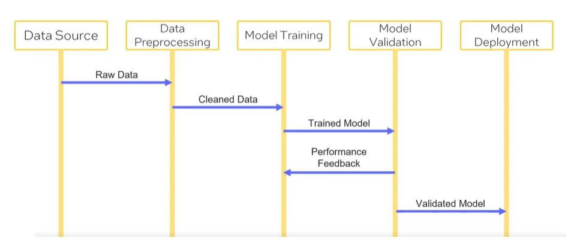

#### Sequence Diagrams 

Illustrate the sequence of steps in a machine-learning pipeline, showing how data flows and components interact. 
Sequence diagrams can be much more complex with conditionals, loops and concurrent operations. 

#### Basic Sequence Diagram

- Basic Version 

