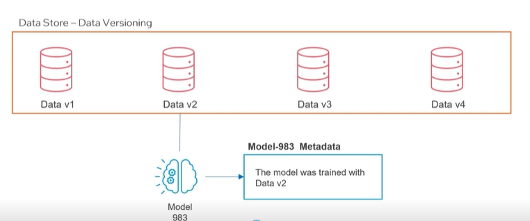
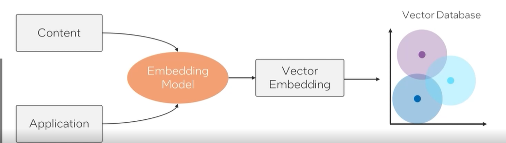

#### Data Management and Feature Engineering 

- Real-time Data Pipelines 
- Data Lakes 
- Feature Stores 

- Data Versioning - to ensure reproducibility and traceability in ML Projects. 

#### Real-time Data Pipelines 

- Vital for ingesting, processing and transforming data in real-time. 
- Supported by tools like Apache Kafka, Apache Flink and Amazon Kinesis 
- Enable real-time analytics and immediate model feedback. 

#### Data Lakes and Warehouses 
- Central Storage for both structured and unstructured data. 
- Supported by Apache Hadoop, Apache Spark, Amazon S3 and Google BigQuery. 

#### Data Versioning 
- Ensures reproducibility and traceability in ML projects. 
- Tools like DVC, Git LFS extend traditional version controls for data. 

#### Feature Stores 
- Specialized repositories for ML feature storage and retrieval 
- Centralize, Manage and Scale feature usage for training and inference. 
- Tools like Feast and Tecton support feature store capabilities. 
- Promote feature engineering best practives and accelerate model development. 

#### Vector Databases 

- Designed to handle high-dimensional vector data in ML 
- Key for efficient indexing and querying in high-dimensional space. 
- Critical for tasks like similarity search and image recognition  
- Enhance AI and MLOps capabilities, especially for recommendation systems. 

