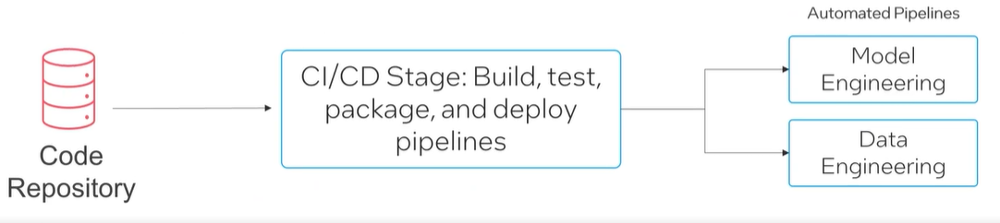

#### Continuous Integration and Continuous Deployment (CI/CD) 

- CI/CD practices in MLOps automate ML model integration, testing, deployment - increasing efficiency and reliability. 
- CI involves automatically building and testing models with each code change, ensuring and error-free and functional codebase. 
- CD automates the transition of models into production, allowing for the swift delivery of updates, with components including automated testing frameworks, deployment pipelines, and monitoring systems.

