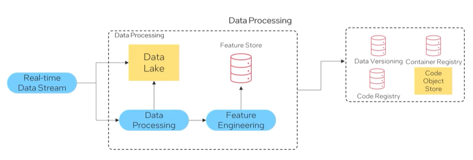

#### Data Management 

- Data Management is crucial to MLOps, ensuring data quality, reliability and availability. 
- Data Management involves the collection, preprocessing and organization of data. 

#### Data Management Components 

- Data Pipelines 
- Data Versioning Systems 
- Data Validation Techniques 

 

- These components enable organizations to handle large data volumes efficiently. 
- They ensure data consistency across different stages of the machine learning lifecycle. 
- They also address data quality and goveranance challenges effectively. 