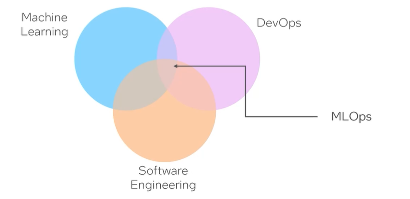

#### What is MLOps? 

- Machine Learning Operations, is a practice that focuses on the integration of machine learning models into operational processes to ensure the reliability, scalability and maintainability of AI systems. 

- It combines DevOps, Software Engineering and ML principles to streamline and automate the end-to-end machine learning lifecycle. 

