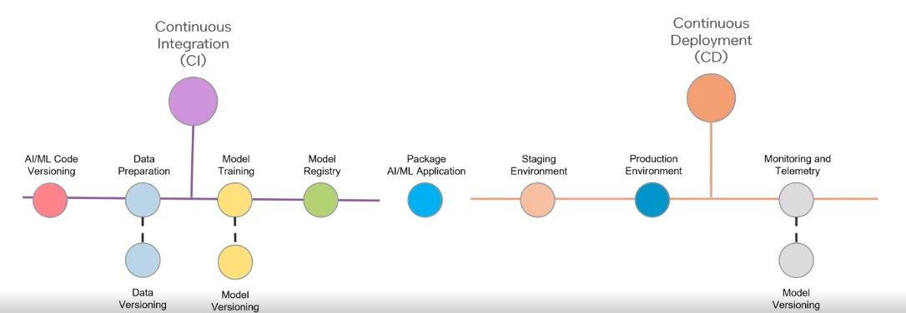

#### MLOps in Production 

- Integration of CI/CD practices to ensure automated deployment and model versioning. 
- Development of automated data pipelines to manage end-to-end data flow and transformations. 
- emphasis on data versioning for tracking training data changes and ensuring reproducibility. 

