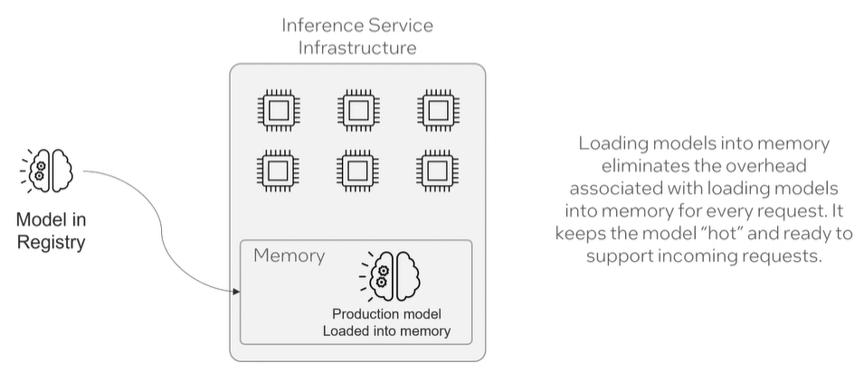
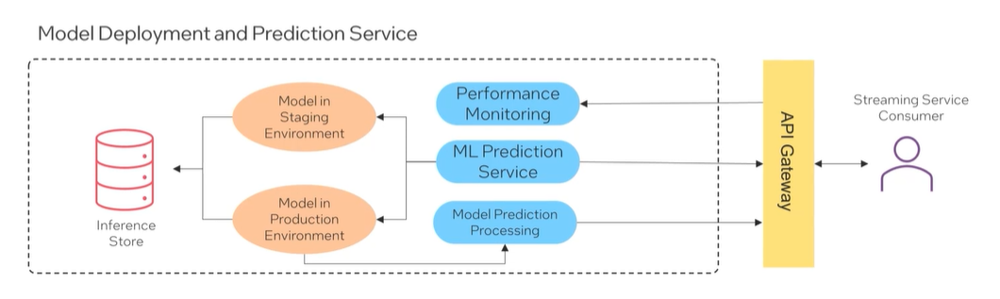

#### Model Deployment and Inference Services 

- Compute Infrastructure and Resilience Measures in Scalable Inference Services. 

#### Hot in memory  
- Models can be deployed by loading and compiling them into the ML prediction service's memory. 

#### ML Prediction Service

- The ML prediction service receives inputs and delivers suitable responses either directly or via post-processing. 
- Its a modular part of a broader production inference pipeline. 

#### Inference Modes 

- Real-time or Online Inference 
- Batch Inference 

